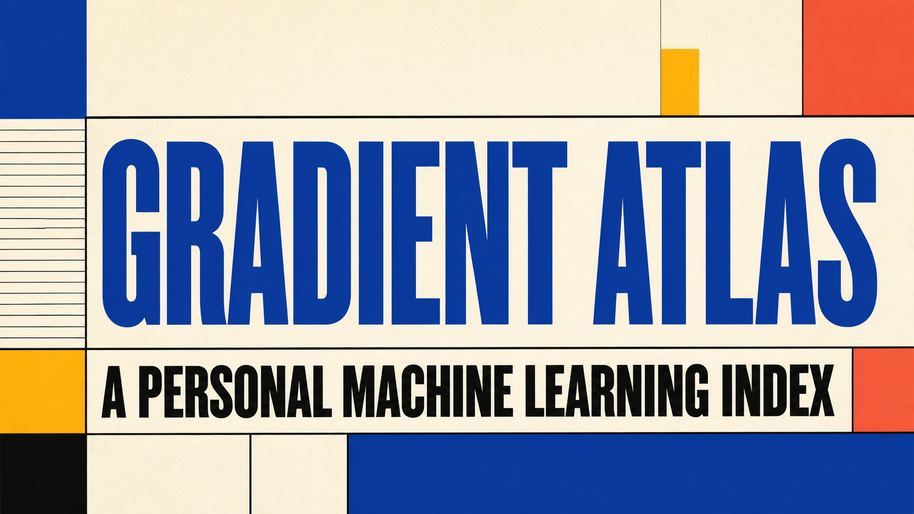

# Gradient Atlas · 梯度图谱

一个持续生长的个人机器学习资源索引，收录真正值得反复打开的 repo、论文入口、课程、博客与工具。



## 已有能力

- 26 个精选 ML 资源，按仓库、研究、博客、课程与工具分类
- 支持全文搜索与 `⌘/Ctrl + K` 快捷聚焦
- 支持“稍后阅读”和随机探索
- 可以添加私人收藏，数据仅保存在当前浏览器
- 响应式布局，适配桌面与移动设备

## 本地运行

需要 Node.js `>=22.13.0`。

```bash
npm install
npm run dev
```

然后打开 `http://localhost:3000`。

## 验证与构建

```bash
npm test
```

## 内容维护

公共资源位于 `app/page.tsx` 的 `resources` 数组中。新增条目时请写清：它解决什么问题、为什么值得收藏，以及最能帮助检索的两个标签。

## License

MIT
